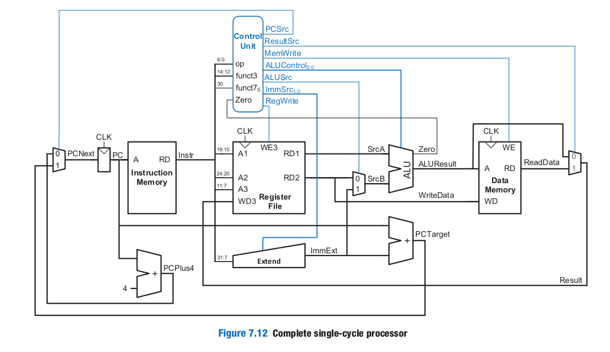

# RV32I Single-Cycle RISC-V Processor

A 32-bit RV32I Single-Cycle RISC-V Processor implemented in Verilog HDL. The processor supports instruction fetch, decode, execute, memory access, and write-back operations for a subset of the RISC-V ISA, providing a complete educational CPU design suitable for FPGA implementation and computer architecture studies.

---

## Architecture Overview

The processor follows a single-cycle datapath architecture where each instruction is completed within one clock cycle.



### Major Components

- Program Counter (PC)
- Instruction Memory
- Register File (32 × 32-bit Registers)
- Immediate Generator / Sign Extension Unit
- ALU Control Unit
- Arithmetic Logic Unit (ALU)
- Data Memory
- Multiplexers
- Main Control Unit
- PC Adder

---

## Features

### Supported Instruction Types

#### R-Type Instructions
- ADD
- SUB
- AND
- OR
- SLT

#### I-Type Instructions
- LW

#### S-Type Instructions
- SW

#### B-Type Instructions
- BEQ

### Processor Specifications

- Architecture: RV32I Subset
- Datapath Width: 32-bit
- Design Style: Single-Cycle
- Language: Verilog HDL
- Register Count: 32 General Purpose Registers
- Clocking: Synchronous Positive Edge Triggered

---

## Datapath Operation

### Instruction Fetch (IF)

The Program Counter (PC) provides the address of the current instruction.

```
PC → Instruction Memory → Instruction
```

The PC is incremented by 4 after each instruction fetch.

---

### Instruction Decode (ID)

The fetched instruction is decoded by:

- Main Decoder
- ALU Decoder
- Register File
- Immediate Generator

Control signals are generated based on:

- Opcode
- funct3
- funct7

---

### Execute (EX)

The ALU performs arithmetic and logical operations.

Supported ALU Functions:

| Operation | ALU Control |
|------------|------------|
| ADD | 000 |
| SUB | 001 |
| AND | 010 |
| OR  | 011 |
| SLT | 101 |

---

### Memory Access (MEM)

Load and Store instructions access Data Memory.

- LW → Read Data Memory
- SW → Write Data Memory

---

### Write Back (WB)

Results are written back into the destination register.

Possible write-back sources:

- ALU Result
- Data Memory Output

---

## Control Unit

The Control Unit consists of:

### Main Decoder

Generates:

- RegWrite
- ImmSrc
- ALUSrc
- MemWrite
- ResultSrc
- Branch
- ALUOp

### ALU Decoder

Generates:

- ALUControl

Inputs:

- ALUOp
- funct3
- funct7

---

## Project Structure

```text
.
├── Single_Cycle_Top.v
├── Single_Cycle_Top_Tb.v
│
├── PC.v
├── PC_Adder.v
│
├── Instruction_Memory.v
├── Data_Memory.v
├── memfile.hex
│
├── Register_File.v
├── Sign_Extend.v
│
├── ALU.v
├── ALU_Decoder.v
│
├── Main_Decoder.v
├── Control_Unit_Top.v
│
├── Mux.v
│
├── FIG01.png
└── README.md
```

---

## Module Description

### PC.v
Program Counter register that stores the current instruction address.

### PC_Adder.v
Generates:

```
PC + 4
```

for sequential instruction execution.

### Instruction_Memory.v
Stores machine instructions and provides instruction fetch functionality.

### Register_File.v
Implements the RISC-V register bank.

Features:

- Two Read Ports
- One Write Port
- 32 Registers
- 32-bit Width

### Sign_Extend.v
Generates immediate values for:

- I-Type
- S-Type
- B-Type

instructions.

### ALU.v
Performs arithmetic and logical operations.

Outputs:

- Result
- Carry
- Overflow
- Zero
- Negative

### Main_Decoder.v
Generates high-level control signals from instruction opcodes.

### ALU_Decoder.v
Generates ALU control signals based on:

- ALUOp
- funct3
- funct7

### Data_Memory.v
Implements memory operations for:

- Load Word (LW)
- Store Word (SW)

### Mux.v
General-purpose multiplexer used throughout the datapath.

---

## Simulation

### Using ModelSim

Compile:

```tcl
vlog *.v
```

Run Simulation:

```tcl
vsim Single_Cycle_Top_Tb
run -all
```

---

### Using Icarus Verilog

Compile:

```bash
iverilog -o cpu *.v
```

Run:

```bash
vvp cpu
```

---

## Sample Program

Machine code instructions can be loaded through:

```text
memfile.hex
```

Instruction memory reads the program and executes it sequentially.

---

## Verification

The design has been verified using:

- Functional Simulation
- Custom Testbench
- Waveform Analysis

Key signals observed:

- PC
- Instruction
- Register Write Data
- ALU Result
- Data Memory Output
- Control Signals

---

## Learning Outcomes

This project demonstrates:

- RISC-V ISA Fundamentals
- CPU Datapath Design
- Control Unit Design
- Verilog HDL Development
- Computer Architecture Concepts
- Digital System Verification

---

## Future Improvements

- Full RV32I Instruction Support
- Jump Instructions (JAL/JALR)
- Hazard Detection Unit
- Data Forwarding
- Five-Stage Pipeline
- Branch Prediction
- FPGA Deployment

---
